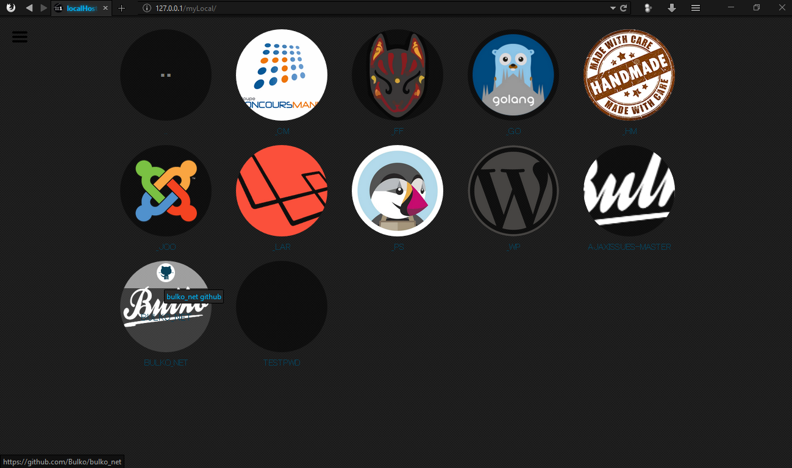

#  MyLocal 
>    MyLocal is a responsive dashboard for your web development environment.  
>    Try it if you are bored of your localhost home page!  

## Why I should use this crap?
1. Include a directory listing *(like every dashboard)*
2. Automatic detection of GitHub repository link
3. Automatic detection of Bitbucket repository link
4. Automatic detection of SVN repository link
5. No database requirement
6. Work with [a lot](#build-status-) of OS, development environment and PHP version. 
7. Custom CSS & JS area
8. It's easy to make your own myLocal template.
9. New  feature [in comming!](./roadmap.md)
10. Is made with  :green_heart: && :coffee: under a [public license](./license.md)

## Requirements

* PHP 5.0+ (php7.1 ready)
* [xampp](https://www.apachefriends.org/index.html) || [wamp](http://www.wampserver.com/en/) || [mamp](https://www.mamp.info/en/)

## How to install?

Clone or paste myLocal folder in your web development environment (xampp, wamp or mamp) root folder (htdocs or www).

   **How to load it in my localhost homepage?**   
   If you want to load myLocal dashboard instead of your classic environment's 
   dashboard you can paste `myLocal/include.php` in your root folder and renamed it to `index.php`.

   **How to load it in a sub-folder?**   
   In your sub-folder create a `index.php` file with a myLocal include inside    

	<?php
		include "YourPath/myLocal/index.php";
	?>

## For Developers

Required [Gulp](https://www.npmjs.com/package/gulp-install) for any update.
MyLocal use [gulp-oyana](https://github.com/Oyana/gulp-oyana) for asset compiling.

## Build status 

| Linux | Windows | Mac | PHP |
|:------:|:----------:|:----:|:----:|
|  |  |   |  |
| |  |  |  |
|| | |  |
|| | |  |
|| | |  |
|| | |  
|| | |  |

## License

This software is distributed under the [GNU 3.0](./license.md) license.
